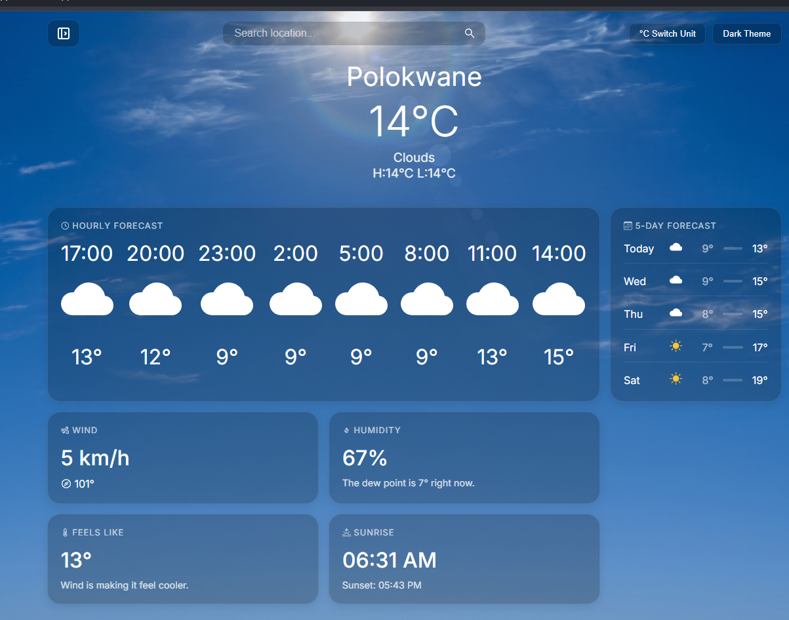

# React Weather App

A dynamic and responsive weather application built to provide real-time weather information, hourly forecasts, and daily outlooks for any location. This project fulfills the ReactTS Task 3 requirements by demonstrating the ability to consume and display data from third-party APIs.

## Preview



## Features

- **Real-Time Weather Info:** Displays current weather conditions including temperature, humidity, and wind speed.
- **Extended Forecasts:** Provides both hourly forecasts and a 5-day daily forecast outlook.
- **Location-Based Forecasting:** Automatically detects and displays weather for the user's current location via browser geolocation APIs, provided permission is granted.
- **Location Search & Save:** Allows users to search for specific locations[cite: 16]. Users can save multiple locations and easily switch between them without needing to search again.
- **Customization:** Includes a settings interface for users to toggle between light and dark themes, as well as switch display units between Celsius (metric) and Fahrenheit (imperial).
- **Offline Access:** Caches weather data in the browser's local storage to provide offline access if the internet connection is lost.
- **Advanced Weather Details:** Displays comprehensive data including "feels like" temperature, wind direction, sunrise and sunset times, and precise moon phase calculations.

## Technologies Used

- **React & TypeScript:** For building dynamic and typed UI components.
- **Axios:** For handling HTTP requests to the OpenWeatherMap API.
- **SunCalc:** Used for calculating accurate moon phases and illumination.
- **React Icons:** For visual indicators of weather conditions, wind, and settings.
- **Local Storage:** Serves as the primary data storage for caching weather data and saving user location preferences.

## Responsive Design

The application layout is highly responsive and optimized for the following common viewport breakpoints:

| Device       | Width   |
| :----------- | :------ |
| Mobile       | 320px   |
| Large Mobile | 480px   |
| Tablet       | 768px   |
| Laptop       | 1024px  |
| Desktop      | 1200px  |

## API Integration

This application relies on the OpenWeatherMap API (`https://api.openweathermap.org/data/2.5/`) to fetch both the current weather data and the extended forecast list. 

## Usage

1. **Allow Location Access:** Upon opening the app, allow location permissions to see the weather for your immediate area.
2. **Search for a City:** Use the search bar to find the weather for any global location.
3. **Save Locations:** Click the **+Add** button after searching to save a city to your quick-access drawer.
4. **Customize View:** Open the settings header to toggle between Dark/Light themes or switch between °C and °F.
5. **View Details:** Scroll through the dashboard grid to view hourly temperatures, the 5-day forecast, wind speeds, and moon illumination stats.

## How to Run the Project Locally

1. **Clone the repository:**
   ```bash
   git clone <https://github.com/Omphile-coder/weather-App.git>